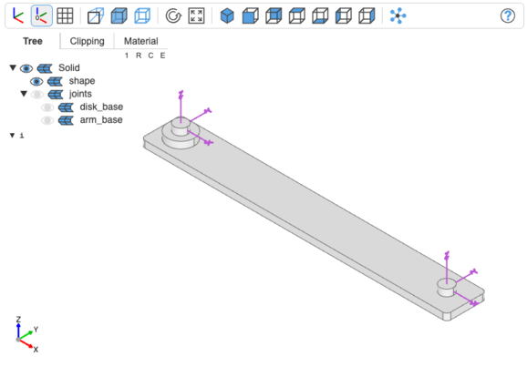
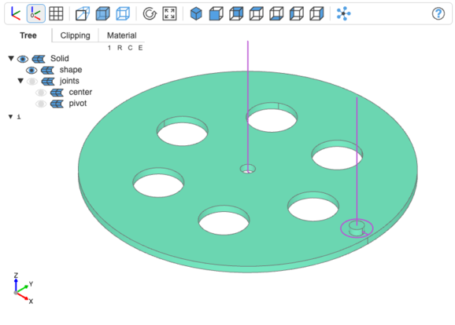
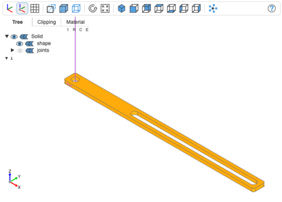
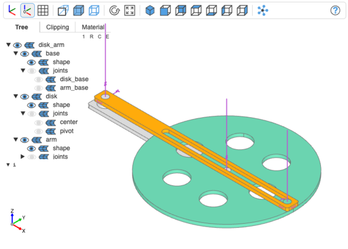
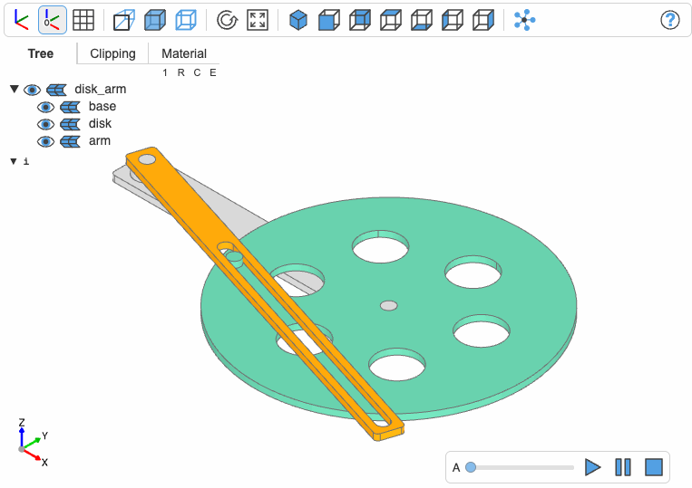
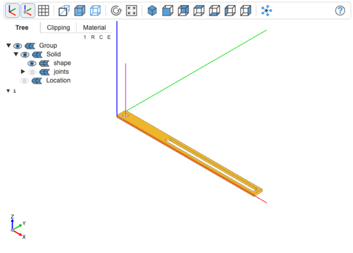
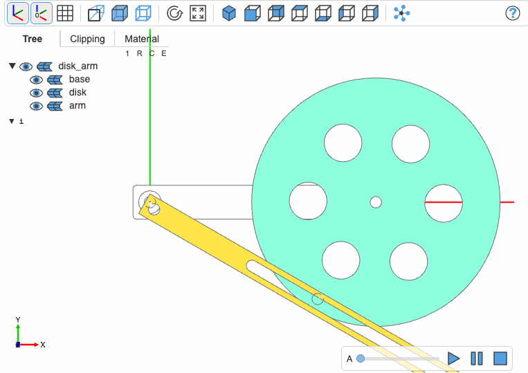

# Animation for [build123d](https://github.com/gumyr/build123d) and [OCP CAD Viewer](https://github.com/bernhard-42/vscode-ocp-cad-viewer)

## 1 Intro

### 1.1 The animation system

The animation feature is built on OCP CAD Viewer and uses the [threejs animation system](https://threejs.org/docs/index.html?q=animation#manual/en/introduction/Animation-system). This is a low level system where you provide two tracks per animated object: The time track and the track of positions or rotations.

For example, the following definitions

```python
duration = 2
max_angle = 360
steps = 180

time_track = np.linspace(0, duration, steps + 1)
rotation_track = np.linspace(0, max_angle, steps + 1)
```

define a full 360° rotation of an object in 2 seconds defined as 181 steps (181 to start with 0° and end with 360°). Each value of the rotation is the angle the object should be rotated to relative to the start position. Hence tracks typically start with 0 and for continuous animationations also end with 0.

### 1.2 The animation library

The `bd_animation` library provides one class and two helper functions:

1.  `class AnimationGroup(build123d.Compound)`:

    A thin layer on top of the standard build123d `Compound`. The initializer gets three keyword parameters:

    - `children`: A dict of object names and objects, e.g. `children={"base": base, "disk": disk, "arm": arm}`
    - `label`: The name of the `AnimationGroup`
    - `assemble`: If the objects have build123d `Joints`, then `assemble` defines how to connect the objects. It is an array of tuples, where each tuple defines one connection. As a subclass of `Compound`, `AnimationGroup` uses `build123d.Joints.connect_to` to connect the objects. For example

      ```python
      assemble=[
          ("base:disk_base", "disk:center"),
          ("base:arm_base", "arm:connect"),
      ]
      ```

      will connect

      - the `center` joint of the object `disk` to the `disk_base` joint of object `base`
      - the `connect` joint of the object `arm` to the `arm_base` joint of object `base`

      The generic pattern is `path:joint_name`. In a hierarchical `AnimationGroup`, `path` will be the path of object names from root down to the object, e.g. `"/hexapod/left_leg/upper_leg"`. The leading `/` can be omitted. The class ensures that the objects are connected _before_ they get added to the `build123d.Compound` (current build123d restriction).

      **Notes:**

      - `AnimationGroup` defines `__getitem__` and as such allows to reference an object in a hierachical `AnimationGroup` as `hexapod["/hexapod/left_leg/upper_leg"]`
      - In order for the animation to work, only show the `AnimationGroup` in OCP CAD Viewer, no other objects: other objects (e.g. joints) will probably alter the paths and disable the proper animation.

2.  `def clone(obj, color=None, origin=None)`:

    This function will use `copy.copy` to build a deep clone of an object, assign a `color` and relocate the object to the `origin`. The `origin` is a `build123d.Location` that should be be used to move an object relative to or around which an object should be rotated.

3.  `def normalize_track(array)`:

    Since animation tracks are relative to the starting location, this function simple subtracts the first array element from all elements of the array

## 2 Example

### 2.1 The objects

Assume we have the following three objects (the code can be found [here](./examples/disk_arm.py)):

- The base

  

- A disk with a hole and a pivot

  

- An arm with a slotted hole

  

### 2.2 The AnimationGroup

As discussed above, we build the animation group by adding the three objects and assembling them.

```python
disk_arm = AnimationGroup(
    children={"base": base, "disk": disk, "arm": arm},
    label="disk_arm",
    assemble=[
        ("base:disk_base", "disk:center"),
        ("base:arm_base", "arm:connect"),
    ],
)

show(disk_arm, render_joints=True)
```



### 2.3 Defining the animation

The disk should rotate around the center and the arm should follow the pivot on the disk. The function `angle_arm` calculates the angle of the arm for each rotation angle of the disk:

```python
def angle_arm(angle_disk):
    ra = np.deg2rad(angle_disk)
    v = np.array((d, 0)) + r * np.array((np.cos(ra), np.sin(ra)))
    return np.rad2deg(np.arctan2(v[1], v[0]))
```

We can then use this function to create the animation track for the disk and for the arm:

```python
animation = Animation(disk_arm)

n = 180
duration = 2

time_track = np.linspace(0, duration, n + 1)
disk_track = np.linspace(0, 360, n + 1)
arm_track = [angle_arm(a) for a in disk_track]

animation.add_track("/disk_arm/disk", "rz", time_track, normalize_track(disk_track))
animation.add_track("/disk_arm/arm", "rz", time_track, normalize_track(arm_track))
```

`add_track` receives the full path of the object to animate. `rx`, `ry`, `rz` tell the animation system to rotate around the x-, y- or z-axis. Other animation tasks are `tx`, `ty`, `tz` which translate the object in x-, y- or z-direction. And `t` allows to provide a 3-tuple `(x,y,z)` with relative coordinates `x`, `y`, `z`. The same object can have more than one animation track, threejs will mix them together.

Finally, initiate the animation:

```python
animation.animate(speed=1)
```



## 3 The need for relocation

That was easy, wasn't it?

The main reason why it was so easy is that the disk and the arm were created with their location being at `(0, 0, 0)`. That means a rotation around `z` rotated the disk around the center of circle and the arm around the center of the hole - exactly what we wanted.

Now, assume we would have had this situation for the arm



with `arm.location` being equal to `Location()`, i.e the world origin, see [disk_arm2.py](./examples/disk_arm2.py).

Applying the same logic as above leads to:



This is clearly not what we want, the arm doesn't rotate around the center of the hole.

This is because the animation system of threejs does not care about build123d joints or so. It simply rotates the object around its location. In this case, we wrap the arm into an `AnimationGroup` and relocate it:

```python
slot = extrude(Pos(d, 0, 0) * SlotCenterToCenter(2 * r, 2 * pr), t, both=True)

arm = Rectangle(4 * pr + (r + d), 4 * pr, align=(Align.MIN, Align.MIN))
arm = extrude(arm, t / 2, both=True)
arm -= Pos(2 * pr, 2 * pr, 0) * slot
arm -= Pos(2 * pr, 2 * pr, 0) * pivot
                                            # <== (1) No joint on arm
arm_group = AnimationGroup(
    children={
        "arm": clone(                       # <== (2) clone the object ...
            arm,
            origin=Pos(2 * pr, 2 * pr, 0),  #     ... and provide the origin to clone
        )
    },
    label="arm_group",
)

RevoluteJoint(
    label="connect",
    to_part=arm_group,                      # <== (3) add the joint to the AnimationGroup ...
    axis=Axis(
        (0, 0, 0),                          #     ... as the z-axis
        (0, 0, 1),
    ),
)
```

The animation group `arm_group` has only one child, `arm`. However, since we want to modify it, we clone it. For convenience, clone takes the `origin` parameter and relocates the arm. The joint cor connecting will be assigned to the animation group and not to the arm object. And, of course, this joint is along the z-axis starting at `(0,0,0)` .

Continuing with the same code as in the example above (2.3), we get the expected result.
