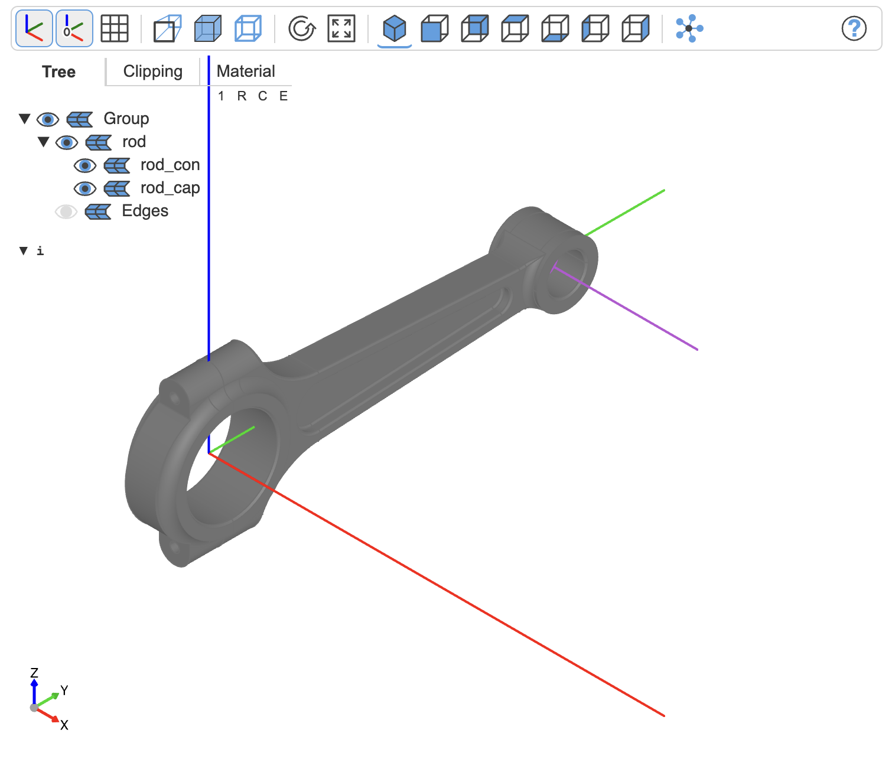
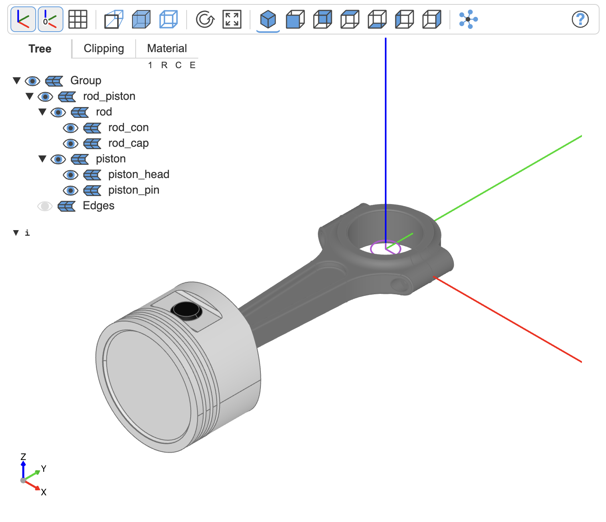

# An animated engine

## 1 The parts

Firstly, download the [engine step file](https://grabcad.com/library/engine-assembly-77).

Then extract the 6 relevant parts from the step file, see [engine.py](../examples/engine.py):


We want to build this hierarchy:
```text
engine
├── engine_block
└── crankshaft
    ├── crankshaft
    ├── rod_piston_0
    │   ├── rod
    │   │   ├── rod_con
    │   │   └── rod_cap
    │   └── piston
    │       ├── piston_head
    │       └── piston_pin
    ├── rod_piston_1
    ...
```

- The `piston` animation group combines the `piston_head` and the `piston_pin`. 
- The `rod` combines the rod connector `rod_con` with the rod cap `rod_cap`. `rod`and `piston` will be connected as `rod_piston` and four of them will be connected to the `crankshaft`.
- The animation group `crankshaft` contains the object `crankshaft` and the four `piston_rod`s. 

This means:
- If the animation group `crankshaft` rotates, the object `crankshaft` will rotate, but also the connected `piston_rod`s.
- The `piston_rod`s need to be rotated around the large hole center, so that the small hole (which will be connected to the `piston`) is aligned with the `engine_block`.
- Finally the piston needs to rotate around the `piston_pin` so that the piston is also aligned with the engine block.

No worries, this will be clearer later.


## 2 The hierachical animation group

### 2.1 The rod animation group

Add `RigidJoint`s to the rod connector and cap and assemble them:

```python
RigidJoint(label="connect", to_part=rod_con, joint_location=Pos(*c))
RigidJoint(label="connect", to_part=rod_cap, joint_location=loc)

rod = AnimationGroup(
    children={"rod_con": rod_con, "rod_cap": rod_cap},
    label="rod",
    assemble=[("rod_con:connect", "rod_cap:connect")],
)
```
No further logic needed.

Next we add a joint to the animation group (details, again, see [engine.py](../examples/engine.py)):
```python
j = RevoluteJoint(label="center_top", to_part=rod, axis=rod_axis)

show(rod, j.symbol)
```



Note: Currently OCP CAD Viewer doesn't show joints of `Compound`s and hence also not of `AnimationGroup`s. Hence the use of `j.symbol` in `show`.

### 2.2 The piston animation group

Add `RigidJoint`s to the piston head and pin and assemble them:

```python
RigidJoint(label="connect", to_part=piston_pin, joint_location=Rot(0, 90, 90))
RigidJoint(label="connect", to_part=piston_head, joint_location=loc)

piston = AnimationGroup(
    children={
        "piston_head": clone(piston_head, origin=loc),
        "piston_pin": clone(piston_pin),
    },
    label="piston",
    assemble=[("piston_head:connect", "piston_pin:connect")],
)
```
Since we connect the pin to the head, we will later need to rotate the head. Hence relocate it to the rotation origin `loc`. `loc` is the mass center of the pin, but needs to be applied to the head in this case, details see [engine.py](../examples/engine.py)

Next we add a joint to the animation group (details, again, see [engine.py](../examples/engine.py)):
```python
RigidJoint(label="pin", to_part=piston, joint_location=Location())
```


### 2.4 Rod connected to piston animation group

This time we already have the joints, they have been assigned to the involved animation groups earlier (see above).

```python
rod_piston = AnimationGroup(
    children={
        "rod": clone(rod, origin=Axis.X.location),
        "piston": clone(piston, origin=Pos(pos)),
    },
    label="rod_piston",
    assemble=[("rod:center_top", "piston:pin")],
)
```

Next we add a joint to the animation group (details, again, see [engine.py](../examples/engine.py)):

```python
RevoluteJoint(label="center_bot", to_part=rod_piston, axis=Axis.Z)
```



### 2.5 The crankshaft animation group

Add `RigidJoint`s to the crankshaft as connectors for the `piston_rod` animation group:


Given these four joints, we can assemble the `rod_piston`s to the crankshaft:

```python
children = {"crankshaft": clone(crankshaft)}
children.update({f"rod_piston_{i}": clone(rod_piston) for i in range(4)})

crank = AnimationGroup(
    children=children,
    label="crankshaft",
    assemble={
        ("crankshaft:pin_0", "rod_piston_0:center_bot"),
        ("crankshaft:pin_1", "rod_piston_1:center_bot"),
        ("crankshaft:pin_2", "rod_piston_2:center_bot"),
        ("crankshaft:pin_3", "rod_piston_3:center_bot"),
    },
)
```

and add a `RevoluteJoint` for the axis to connect it to the engine block later

```python
RevoluteJoint(label="axis", to_part=crank, axis=Axis((0, 0, 0), (1, 0, 0)))
```


### 2.5 The complete engine animation group

We assign a joint to the engine block and connect the assembled crankshaft to it

```python
RigidJoint(label="connect", to_part=engine_block, joint_location=Rot(0, -90, 0))

engine = AnimationGroup(
    children={"engine_block": engine_block, "crankshaft": crank},
    label="engine",
    assemble=[("engine_block:connect", "crankshaft:axis")],
)
```


## 3 The animation

Let's ignore the mathematics behind the movements, they can be seen in [engine.py](../examples/engine.py).

Firstly, rotate the crankshaft:

```python
duration = 2
crank_track = []
piston_track = [[], [], [], []]
rod_track = [[], [], [], []]

time_track = np.linspace(0, duration, 181)

for a in np.linspace(0, 360, 180 + 1):
    crank_track.append(a)
```


Since the `piston_rod`s are in a sub hierarchy of the crankshaft, they rotate with the crankshaft.

Now, let's align the rod top with the engine block:

```python
for i in range(4):
    animation.add_track(
        f"/engine/crankshaft/rod_piston_{i}",
        "rz",
        time_track,
        normalize_track(rod_track[i]),
    )
```


Finally align the pistons:

```python
for i in range(4):
    animation.add_track(
        f"/engine/crankshaft/rod_piston_{i}/piston",
        "rz",
        time_track,
        normalize_track(piston_track[i]),
    )
```


