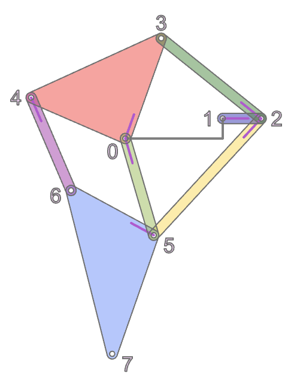
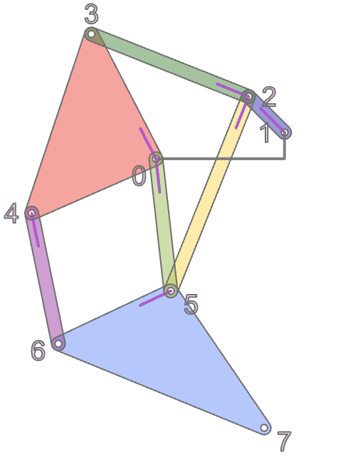
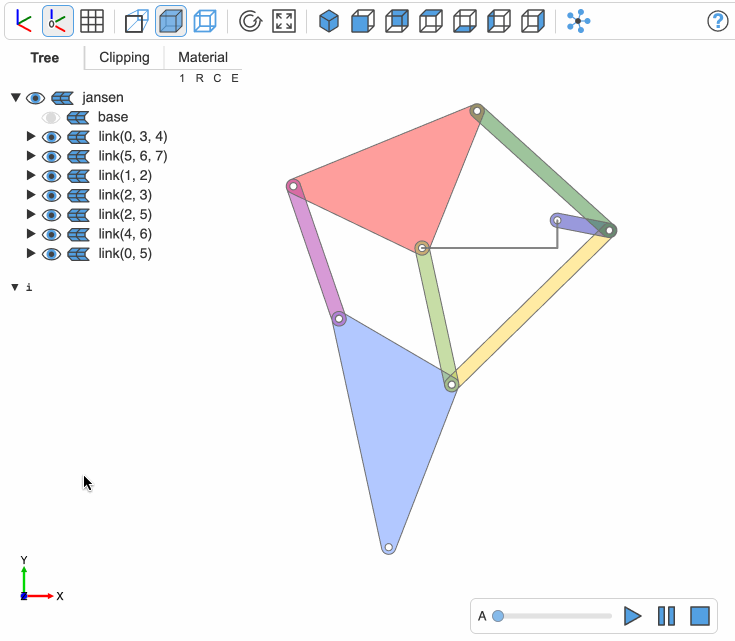

# An animated Jansen linkage

## 1 The parts



There are two triangles and 5 links referenced by their points:
`(0, 3, 4)` and `(5, 6, 7)` are the triangle indexes and `(1, 2)`, `(2, 3)`, `(2, 5)`, `(4, 6)`, and `(0, 5)` are the oriented link indexes.

The function `triangle` creates a rounded triangle for the given point indexes and the function `link` does the same for the links.

The function `linkage` returns the positions of the points and the angles of triangles and links at a given `alpha`, which is the angle of rotation of `link(1, 2)`. The image above shows points and directions of triangles and links for `alpha = 0`. For `alpha = 135` it returns



Given the outpout of `linkage`, we have everthing to animate the linkage.

The tracks are:

```python
time_track = np.linspace(0, duration, n + 1)
position_track = {id: [] for id in ids}
angle_track = {id: [] for id in ids}

for alpha in np.linspace(0, 360, n + 1):
    points, angles = linkage(alpha)
    for id in ids:
        p0 = points[id[0]]
        position_track[id].append((p0[0], p0[1], level[id]))
        angle_track[id].append(angles[id])
```

and the animation definition is

```python
ids = [(0, 3, 4), (5, 6, 7), (1, 2), (2, 3), (2, 5), (4, 6), (0, 5)]

for id in ids:
    name = f"/jansen/link{id}"

    # make sure to normalize each track, i.e. subtract the first point from every point
    animation.add_track(name, "t", time_track, normalize_track(position_track[id]))
    animation.add_track(name, "rz", time_track, normalize_track(angle_track[id]))
```

This results in:

